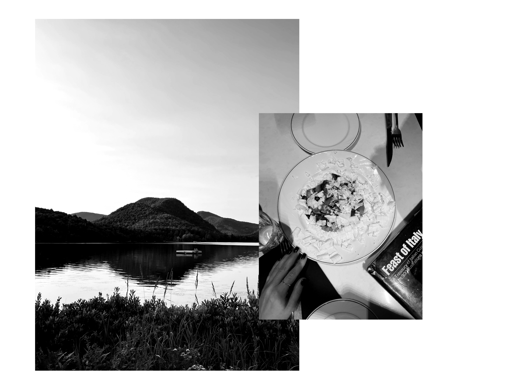

Welcome to my professional world! I'm Anastasia Kozlova, a Product/UX Designer with over 6 years of experience crafting intuitive and dynamic 
digital experiences. I have led projects from 0 to 1, transforming initial 
concepts into fully realized products. 



With a Master’s degree in Industrial Design, I combine deep user empathy 
with a strategic design process to deliver solutions that enhance usability 
and engage users meaningfully. 

Throughout my career, I've had the privilege of collaborating with leading companies and innovative startups, including Microsoft, BAT, XR Server,
 and Arcadia.
{data-zoomable}

When I’m not designing, you’ll probably find me deep into what makes us humans tick—whether it’s diving into a book on psychology or observing the world around me with curiosity. The gym has become my go-to spot for clearing my mind and boosting my creativity.


I’ve also got a serious case of wanderlust and a love for great food. Exploring new places and savoring different cuisines is my kind of adventure, whether I’m with friends, family, or just enjoying some solo time. If you’re curious about design
or just feel like chatting, don’t be shy—drop me a message!
{data-zoomable}
