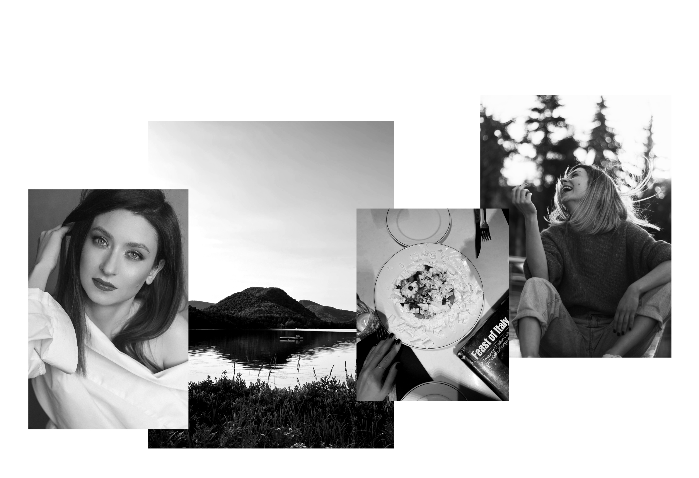

# Hi there! 👋🏻
Hey there! I'm Annie (Anastasia), a Product Designer with 5+ years of experience crafting intuitive, scalable, and engaging digital experiences.

I’ve led projects from 0 to 1, turning ideas into fully functional products across industries like finance, healthcare, entertainment, and e-commerce. With a Master’s in Industrial Design, I blend logic with creativity, ensuring every solution is both strategic and user-centered.

From conducting research and running user interviews to building design systems that enhance efficiency, my passion is reducing cognitive load, optimizing workflows, and making products seamless and accessible for all users.
I’ve worked with companies like Microsoft, BAT, and innovative startups, collaborating closely with developers, PMs, and stakeholders to bring impactful solutions to life. I always aim for designs that not only look great but truly work.

Outside of design, I’m endlessly curious about human behavior, enjoy playing rocket sports, and religiously go to the gym. If you ever want to chat about travel, psychology, or great food - I’m all in!

Looking for a designer who’s strategic, adaptable, and ready to make an impact? Let’s connect! 🚀
{data-zoomable}

## Additionally
Due to NDAs, I can’t showcase some of my best work but am happy to share details upon request. 
