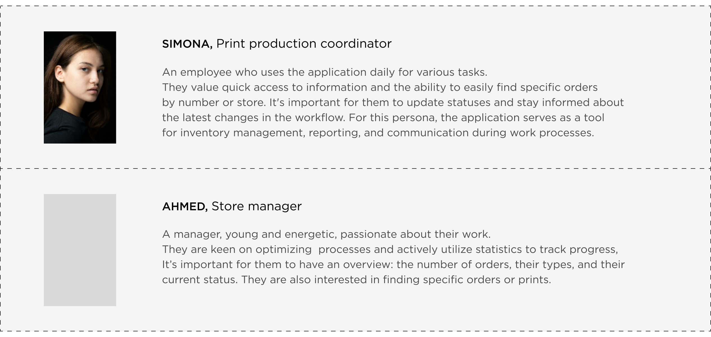
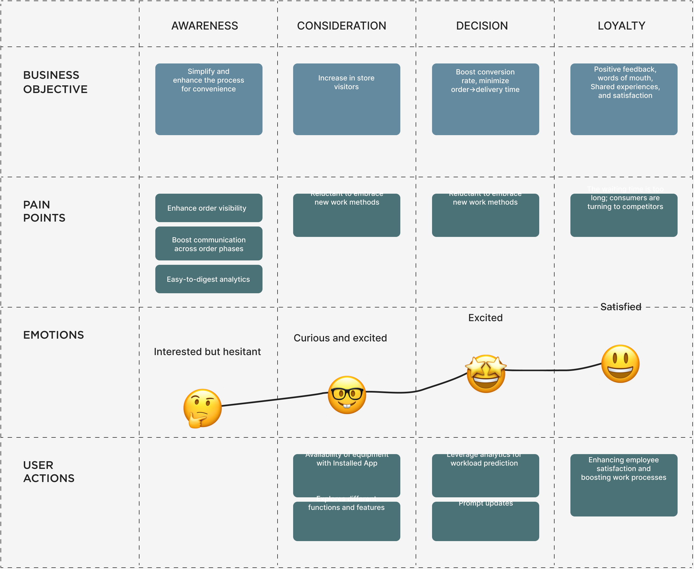
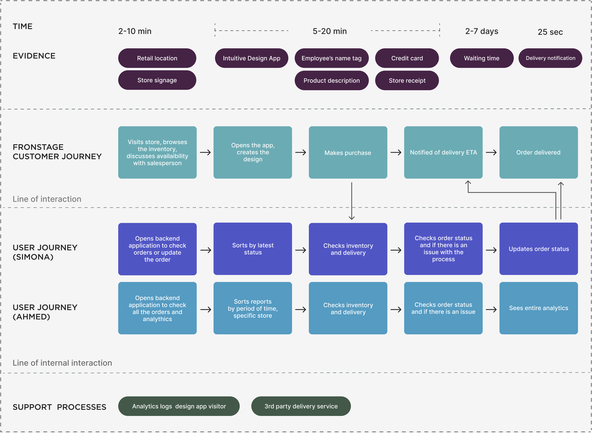
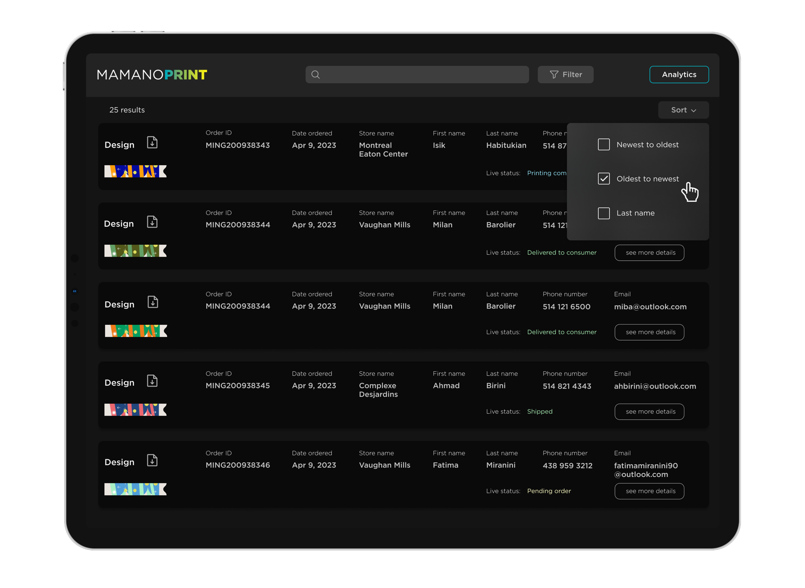
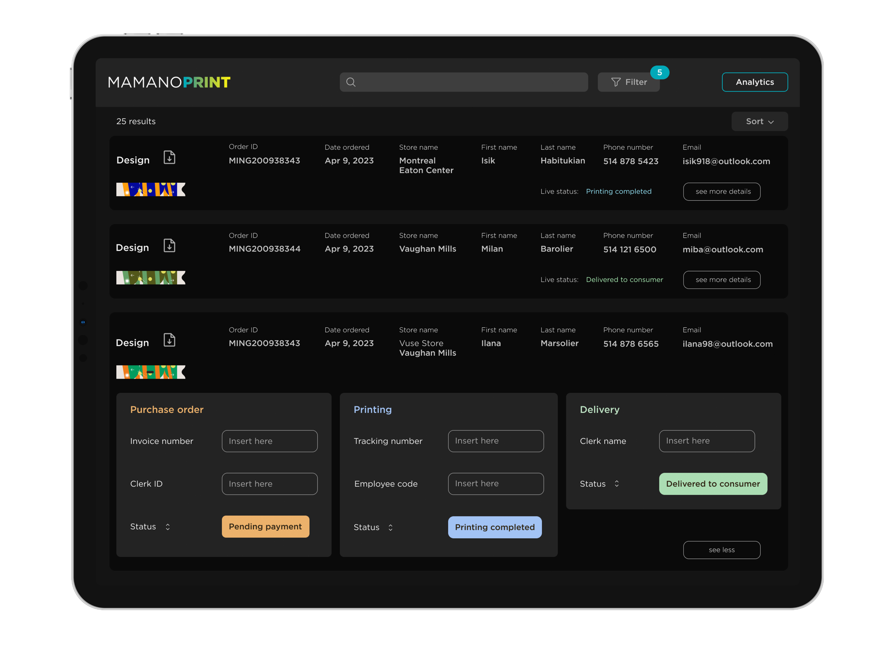

# Management System for Optimal Production Control

## UX Personas
Created personas to accurately represent the users, ensuring the app’s design was tailored to their specific needs.
{data-zoomable}

## User journey map
Developed a user journey map to ensure the app design was user-centric and met the practical needs of its users.
{data-zoomable}

## Service blueprint
Crafted a detailed project blueprint to guide the development process, ensuring alignment with strategic objectives.
{data-zoomable}

## Custom Dashboard Design
Developed dashboards that provided essential real-time insights into asset performance, supporting quick and informed decision-making.
{data-zoomable}
Home screen featuring easy sorting and result count

 {data-zoomable}
Expanded order with fill-in fields

