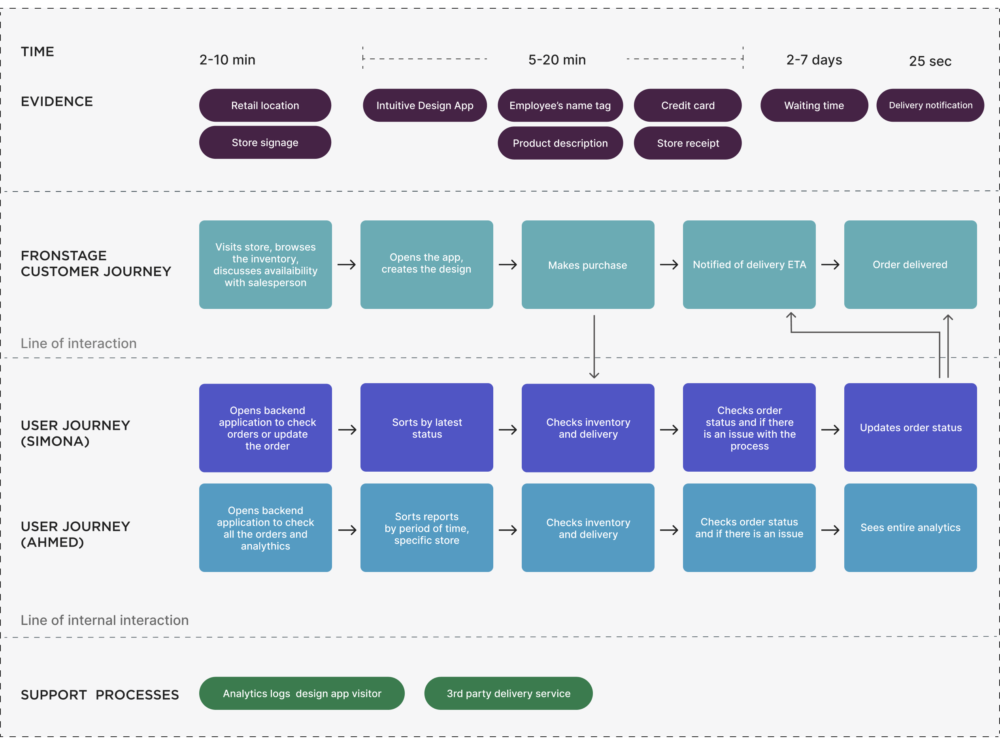
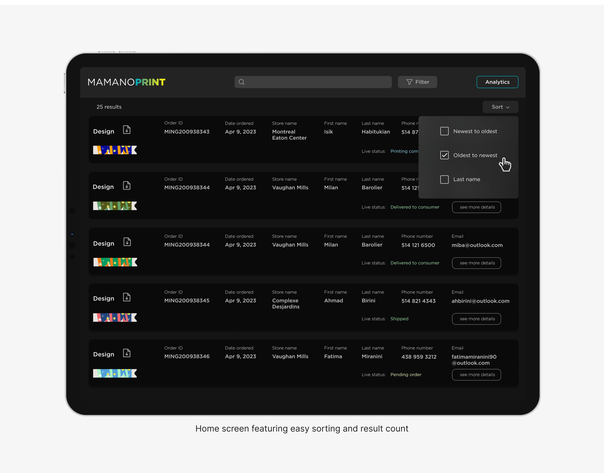
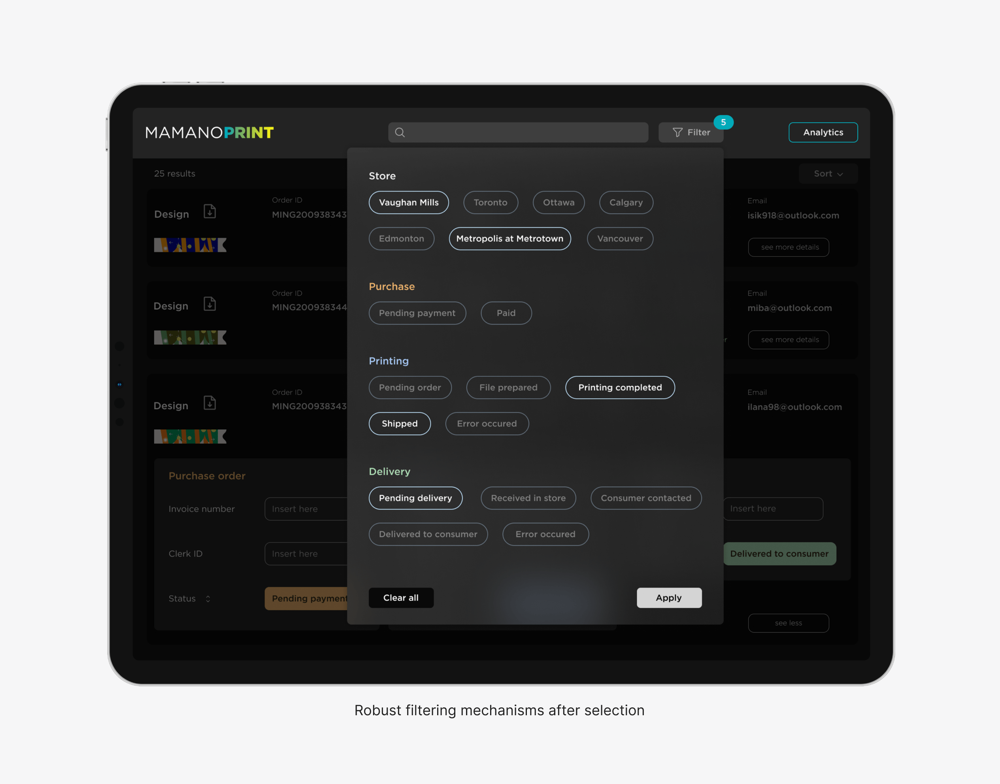

## Innovative App Design: 
# Enhancing Internal Operational Processes
I led the zero-to-one development of an internal application designed to enhance operations across our client's store, warehouse, printing facility, and delivery services. This app includes a sophisticated reporting feature that enables the creation of custom dashboards for monitoring key performance metrics, significantly enhancing operational visibility from the ground up{data-zoomable}

## UX Personas
Created personas to accurately represent the users, ensuring the app’s design was tailored to their specific needs.
{data-zoomable}

## User journey map
Developed a user journey map to ensure the app design was user-centric and met the practical needs of its users.
{data-zoomable}

## Service blueprint
Crafted a detailed project blueprint to guide the development process, ensuring alignment with strategic objectives.
{data-zoomable}

## Custom Dashboard Design
Developed dashboards that provided essential real-time insights into asset performance, supporting quick and informed decision-making.
{data-zoomable}

 {data-zoomable}

{data-zoomable}

 {data-zoomable}

 <!-- Adds 30px of space -->

## Results and Impact
### Increased Operational Visibility: 

The app’s dashboards enhanced management’s ability to oversee operations, leading to a 30% reduction in decision-making time.
### Simplified Task Management: 

The app’s user-friendly design simplified daily operations, reducing process-related errors by 25% and increasing operational efficiency by 20%.
### Stakeholder Satisfaction:
Close collaboration with stakeholders during the project ensured the app met their needs, leading to a 95% satisfaction rate among users.
### Operational Improvements:
After deployment, the client reported a 40% increase in workflow efficiency, and the clarity of processes improved significantly, enhancing overall satisfaction with organizational operations.

