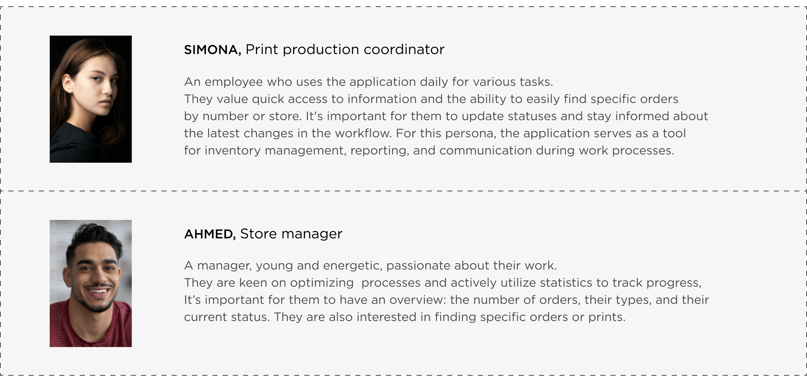
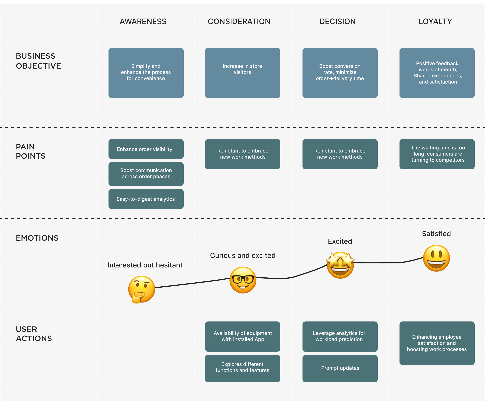

# Project-2

## Perfecting Personalization: 
# Customizable Platform for Vaping Devices
In the rapidly evolving e-commerce landscape, the ability to personalize products has become a key differentiator for brands.
We transformed how customers interact with vaping devices by offering a platform for creating personalized designs.
This project was about more than customization; it was about embedding the user's personal creative flair into the product
they purchase, increasing brand loyalty and user satisfaction.{data-zoomable}

## Strategic Goal of the Project
The primary strategic goal was to make the brand stand out in a saturated market by offering a unique, personalized user experience. This initiative aimed to retain current customers and attract new ones through innovative customization options that encouraged creativity and interaction. Due to NDA restrictions, some project details are generalized.{data-zoomable}

## User journey map
Developed a user journey map to ensure the app design was user-centric and met the practical needs of its users.
{data-zoomable}
