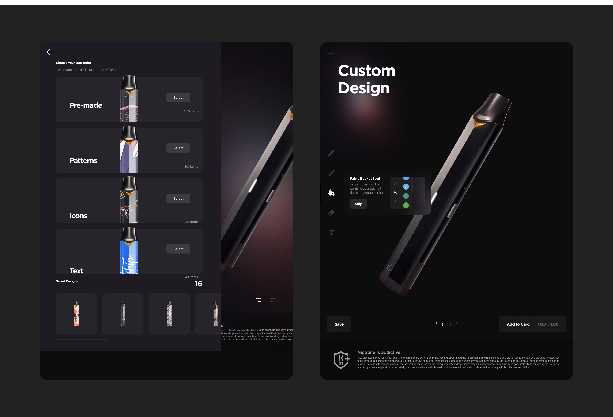
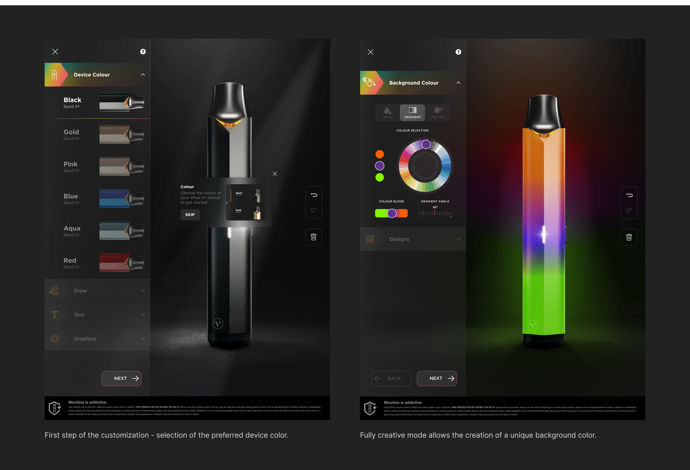
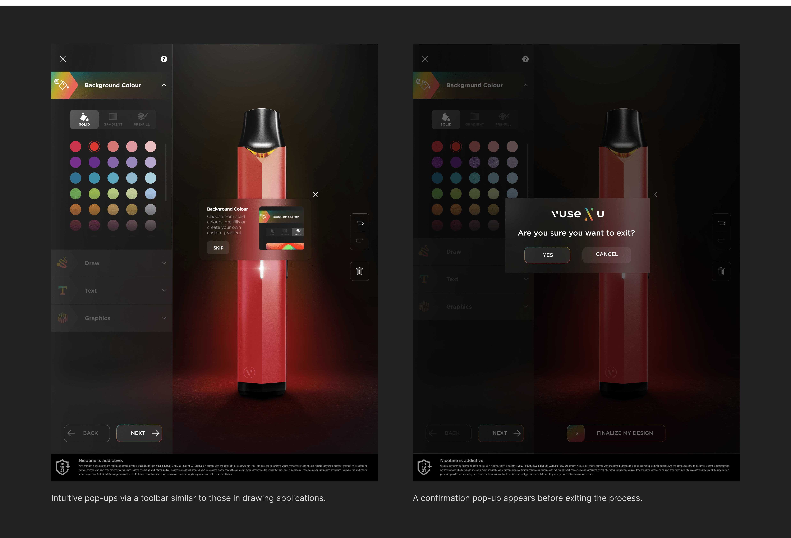
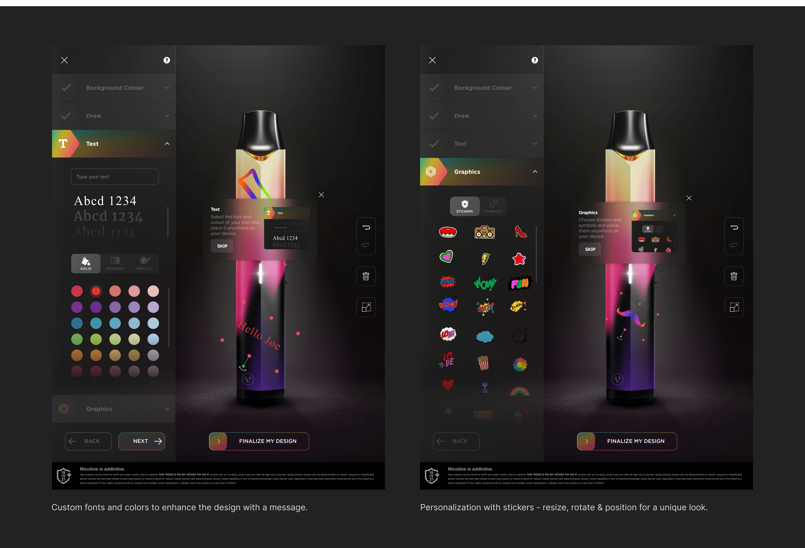

# Project-2

## Perfecting personalization: 
# Customizable platform for vaping devices
In the rapidly evolving e-commerce landscape, the ability to personalize products has become a key differentiator for brands.
We transformed how customers interact with vaping devices by offering a platform for creating personalized designs.
This project was about more than customization; it was about embedding the user's personal creative flair into the product
they purchase, increasing brand loyalty and user satisfaction.{data-zoomable}

## Proposed concept
{data-zoomable}

## Objectives and Actions

### Define dhe target audience
Action: Conducted comprehensive market research to create detailed personas for our target demographic.
Outcome: Identified people aged 20-45 with interests
in lifestyle trends, arts, and personal expression as our core audience. 
### Enhance user engagement
Action: Developed a user customization feature that
enabled users to personalize their vaping devices.
Outcome: This feature significantly enhanced user
interaction with the brand, turning standard customers
into brand advocates.

## Challenges and Solutions. Interface redesign challenges
{data-zoomable}

## User research insights
Problem: Initial feedback indicated that users
found the customization process boring, not
enough engaging.
Solution: Streamlined the customization options and introduced guided tutorials, making the design process more accessible and less daunting for users.

## Design process

### Wireframing and Prototyping
   Developed initial wireframes that focused on optimizing user flow and simplifying the customization process.
   Created high-fidelity prototypes that were iteratively refined based on stakeholder feedback, ensuring the final product met both business and user needs.

### Atomic design system
   Established a modular design system that allowed for scalable and consistent application across different parts of the platform.
   This system enabled rapid prototyping and efficient updates, reducing development time
and ensuring a cohesive user experience across the platform.

## Final design
{data-zoomable}
1.First step of the customization - selection of the preferred device color.
2.Fully creative mode allows the creation of a unique background color.

{data-zoomable}
1.Intuitive pop-ups via a toolbar similar to those in drawing applications.
2.A confirmation pop-up appears before exiting the process.

{data-zoomable}
1.Custom fonts and colors to enhance the design with a message.
2.Personalization with stickers - resize, rotate & position for a unique look.

## Results and Reflections
As the lead product designer for a customizable vaping platform, I faced and overcame many challenges, gaining valuable insights that boosted my design skills and professional growth. This project was more than just a technical task; it was an exploration of user psychology and brand interaction. 
{data-zoomable}
The redesign had a significant positive impact on user engagement, with a 314% increase in users and a 196% rise in customized design sales three months post-launch. However, collaboration with PMs and developers was crucial, ensuring their input and technical constraints were considered throughout. This success, combined with other projects, has propelled the Canadian market into the top three among over 25 countries globally. These results will continue to improve as users become more familiar with the platform.

## Achievements
### Enhanced engagement

By introducing a platform that allowed users to personalize their vaping devices, we significantly increased user engagement. This initiative transformed passive buyers into active participants in the brand's ecosystem, deepening their connection to the product.

### Brand differentiation
The customizable platform sets the brand apart in a competitive market.
By offering a unique and personal user experience, we not only retained
a loyal customer base but also attracted new users intrigued by the prospect
of personalization.

### Positive feedback
The feedback from users and stakeholders was overwhelmingly positive, reaffirming the project’s success. The platform was praised for its intuitive design and user-friendly interface, which made the customization process a delightful experience.

## Personal insights
### User-centric design 
A key takeaway from this project was prioritizing user needs throughout the design process. From conceptualization to execution, our focus on user satisfaction ensured the platform was both accessible and valuable, fostering engagement at every step.

### Iterative process 
The project reinforced the value of iterative design and agile methodologies. Continuous testing, feedback, and refinements were instrumental in developing a platform that truly resonated with users
and met business objectives.

### Collaboration and Leadership
Leading a cross-functional team taught me the importance of collaboration and effective communication. Working closely with developers, product managers, and marketing professionals, I gained a broader perspective on how design integrates with other disciplines to create a cohesive product.

