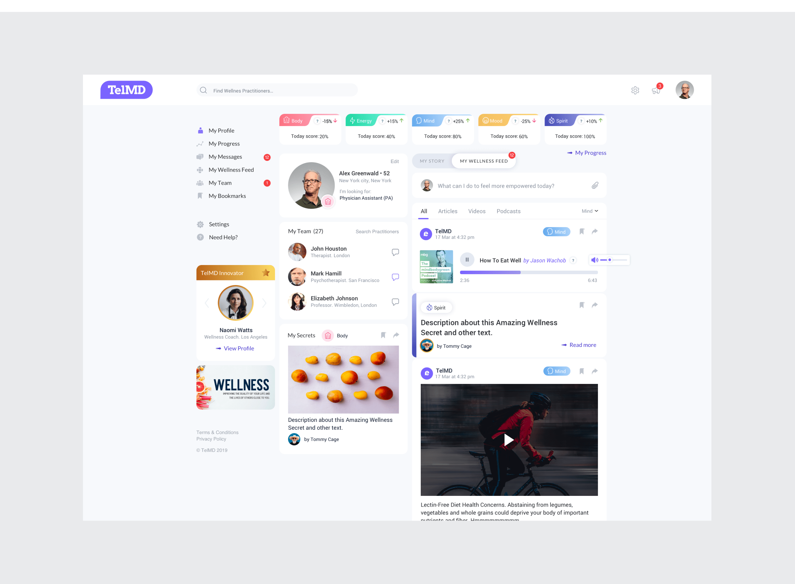

## Seamless Health: 
# Designing a Telemedicine Experience
I was part of the UX/UI design team of a sophisticated Telemedicine platform aimed at transforming the American healthcare landscape. My task was to integrate essential medical consultation features — such as video chats, text messaging, and payment systems — into a user-friendly interface that also included health tracking, personalized dashboards, and a resource center filled with informative health articles.
{data-zoomable}

# Key Challenge
The primary challenge was to merge a wide range of functionalities into a coherent and easy-to-navigate interface that catered to both patients and healthcare professionals, ensuring accessibility while maintaining advanced capabilities.
{data-zoomable}
