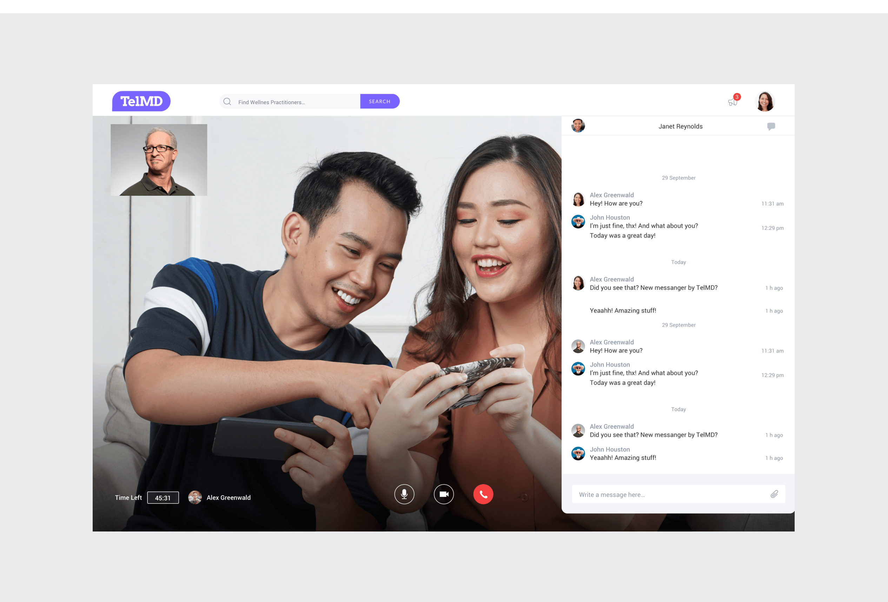
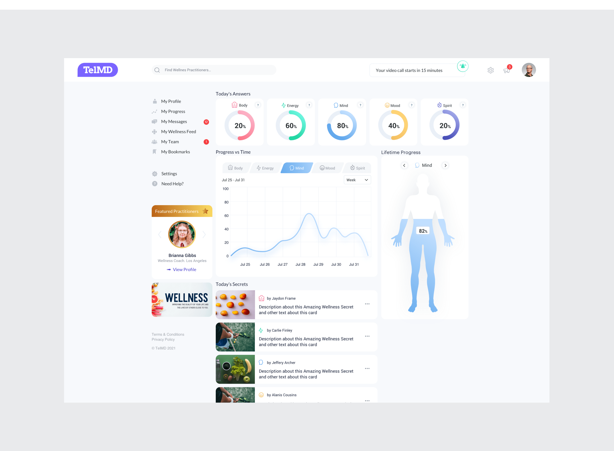

## Seamless health: 
# Designing a telemedicine experience
I was part of the UX/UI design team of a sophisticated Telemedicine platform aimed at transforming the American healthcare landscape. My task was to integrate essential medical consultation features — such as video chats, text messaging, and payment systems — into a user-friendly interface that also included health tracking, personalized dashboards, and a resource center filled with informative health articles.
{data-zoomable}

# Key challenge
The primary challenge was to merge a wide range of functionalities into a coherent and easy-to-navigate interface that catered to both patients and healthcare professionals, ensuring accessibility while maintaining advanced capabilities.
{data-zoomable}

# Thes solution
## Comprehensive communication tools: 
I designed a seamless suite of communication tools including video calls, messaging, and live chat to enhance interaction between patients and healthcare providers.
{data-zoomable}

## Dynamic user profiles and health dashboards: 
I developed detailed user profiles and dashboards that allow patients to monitor their health, manage appointments, and access personalized health content.
{data-zoomable}

## Resource center integration:
I integrated a section for health articles and interactive content to boost user engagement and provide valuable wellness insights.
{data-zoomable}

# Process 
## Prototyping:
Joined the project at the prototyping stage and collaborated closely with the design lead to create the required functionalities.

## Iterative design and testing:
Worked through multiple design iterations, incorporating feedback from project managers and adjusting features to better meet user needs.

## Tool integration:
Utilized Sketch for design, Zeplin for handoff to engineers, and InVision App for client presentations and file sharing.

# Final design overview
{data-zoomable}
{data-zoomable}
{data-zoomable}

# Results and Reflections
## Increased access:
Following the launch of the Telemedicine platform, there was
a 50% increase in new users signing up for health consultations, demonstrating enhanced access to medical services.

## Doctor collaboration:
The platform facilitated a 30% rise in collaborative cases among specialists, improving multi-disciplinary approaches to patient care.

## User engagement:
The introduction of customizable health dashboards and interactive tools led to a 40% increase in user engagement with health tracking features.

## Customer satisfaction:
Post-launch surveys indicated a 90% satisfaction rate among users, highlighting the platform’s effectiveness in meeting their medical and health management needs.

