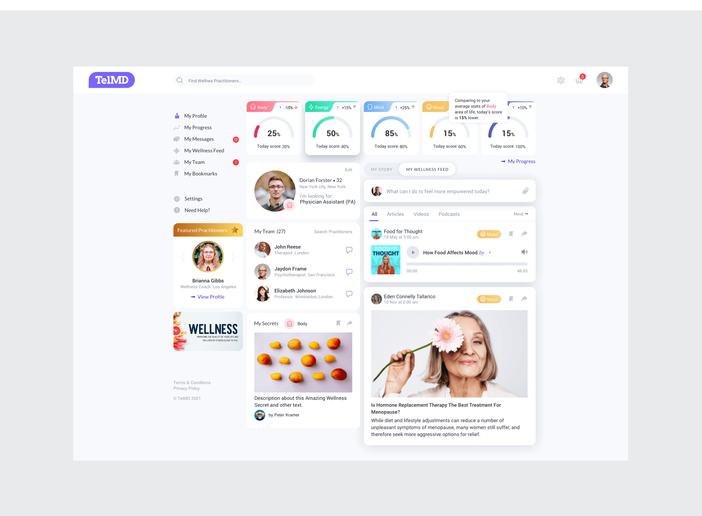

## Seamless health: 
# Designing a telemedicine experience
I was part of the UX/UI design team of a sophisticated Telemedicine platform aimed at transforming the American healthcare landscape. My task was to integrate essential medical consultation features — such as video chats, text messaging, and payment systems — into a user-friendly interface that also included health tracking, personalized dashboards, and a resource center filled with informative health articles.
{data-zoomable}

## Key challenge
The primary challenge was to merge a wide range of functionalities into a coherent and easy-to-navigate interface that catered to both patients and healthcare professionals, ensuring accessibility while maintaining advanced capabilities.
{data-zoomable}

## Event App 
### Event Streaming & Interactive Engagement Experience

I worked as a UX/UI designer on an intuitive app that transforms the virtual event experience, offering users the ability to engage with both live and online events. Interactive features like real-time Q&A, polls, and live chat create a space for attendees to actively participate, exchange insights, and collaborate in real time.

The platform also offers detailed event pages with speaker bios, personalized schedules, and custom agendas, ensuring attendees have everything they need before, during, and after each event. Combining user-centered design with cutting-edge interactive tools, this app elevates engagement and fosters lasting connections between participants.

# Team & Collaboration
The project was developed by a cross-functional team, including:

3 UX/UI Designers

Design Lead

Developers

Stakeholders

Project Managers

My specific role focused on designing the tablet and desktop breakpoints for the platform.

# Challenges & Solutions
One of the biggest challenges was designing the event calendar. As we approached tight deadlines, we proposed multiple calendar views to improve user experience. However, the development team highlighted that implementing our initial designs would take three times longer than expected.

To address this, we initiated close collaboration with the developers, holding frequent meetings to refine the design while maintaining functionality. By working together, we successfully adjusted the design to balance usability and development feasibility!

# Outcome
Through effective collaboration, we delivered a well-structured, user-friendly event calendar that met both user needs and technical constraints. The project was completed on time, ensuring a seamless experience for event attendees across devices.

<iframe width="560" height="315" src="https://www.youtube.com/embed/0vbcgUm2NTA" frameborder="0" allow="accelerometer; autoplay; clipboard-write; encrypted-media; gyroscope; picture-in-picture" allowfullscreen></iframe>

