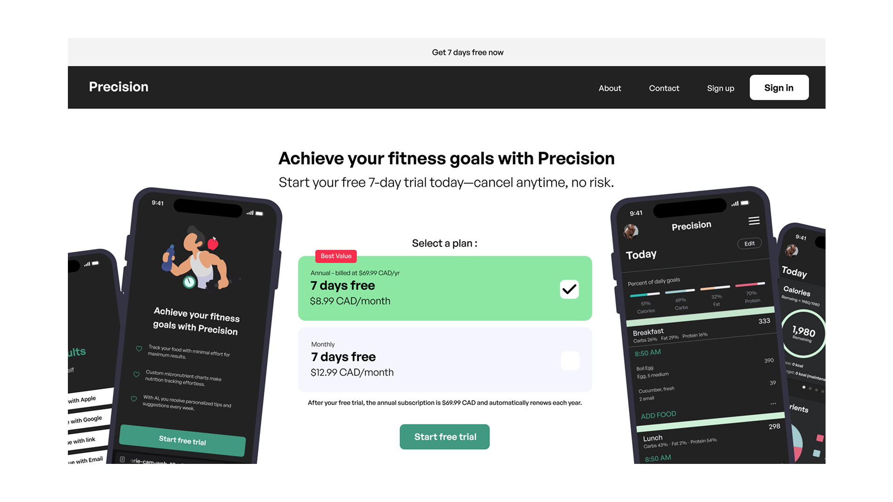
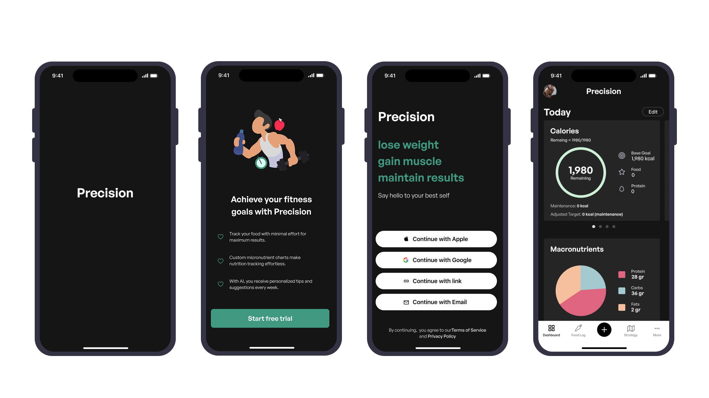

## Easy to use app
# With faster food logging workflows on the market
I am currently working on developing an app that will streamline food logging, making it faster and more effortless with the help of AI.
{data-zoomable}

## Key challenge
The primary challenge is to do the research and see what are the main pain points for user with current apps
{data-zoomable}
{data-zoomable}
{data-zoomable}

## User research insights
Problem: Initial feedback indicates that users find food logging challenging due to its time-consuming nature and the difficulty of maintaining consistency. This leads to a higher likelihood of users abandoning the process.

Solution:
Leveraging AI to simplify and accelerate food logging. This can be achieved by allowing users to:

- Scan barcodes,
- Take a picture of a restaurant menu description, or
- Upload a photo of their meal for automatic recognition.
- This approach aims to enhance user experience, increase engagement, and improve long-term adherence.

{data-zoomable}
{data-zoomable}
{data-zoomable}

## Proposed design

{data-zoomable}

This project is still in development, with developers currently focused on building the mobile application.

