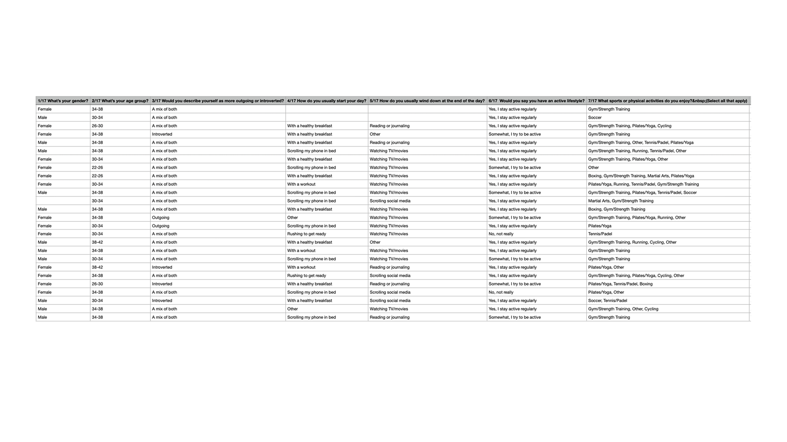
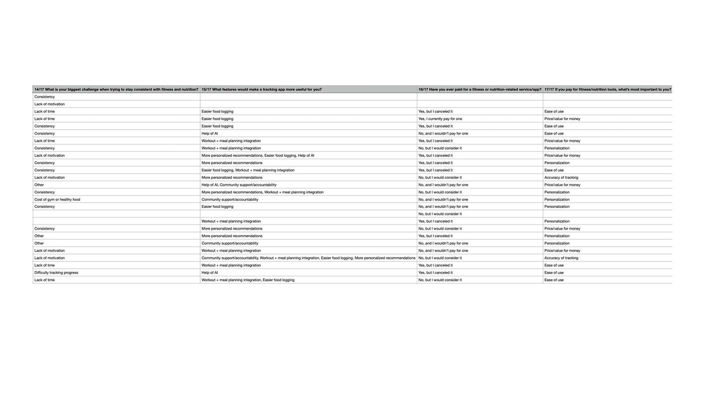
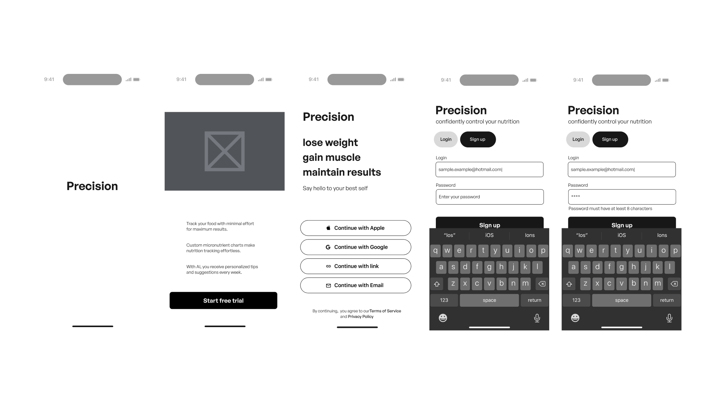
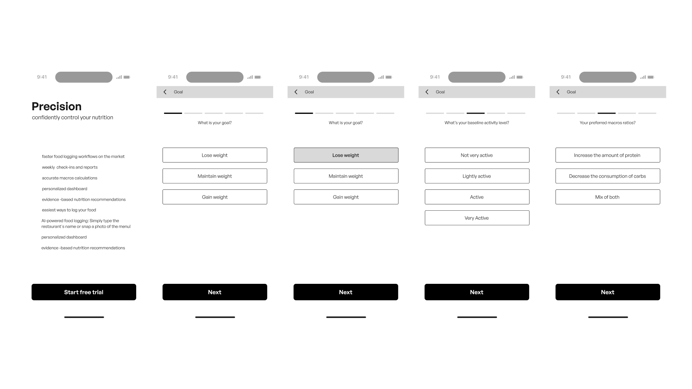
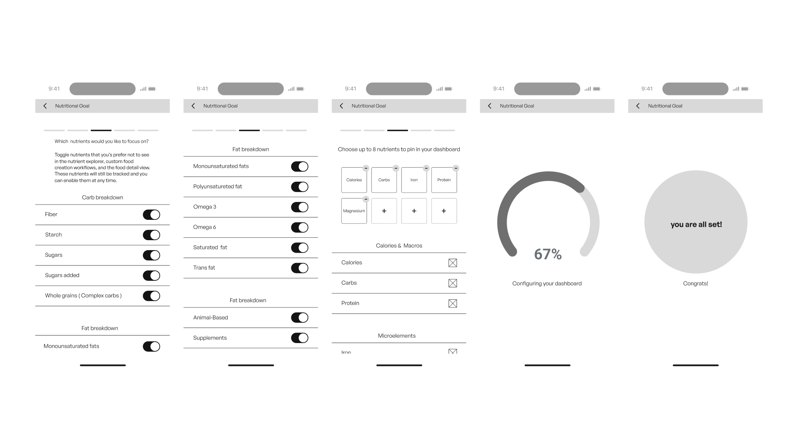

## Easy to use app
# With faster food logging workflows on the market
I currently work on creating an app what will help log in food faster with less efforts with a help of AI
{data-zoomable}

## Key challenge
The primary challenge is to do the research and see what are the main pain points for user with current apps
{data-zoomable}
{data-zoomable}
{data-zoomable}

{data-zoomable}
{data-zoomable}
{data-zoomable}

